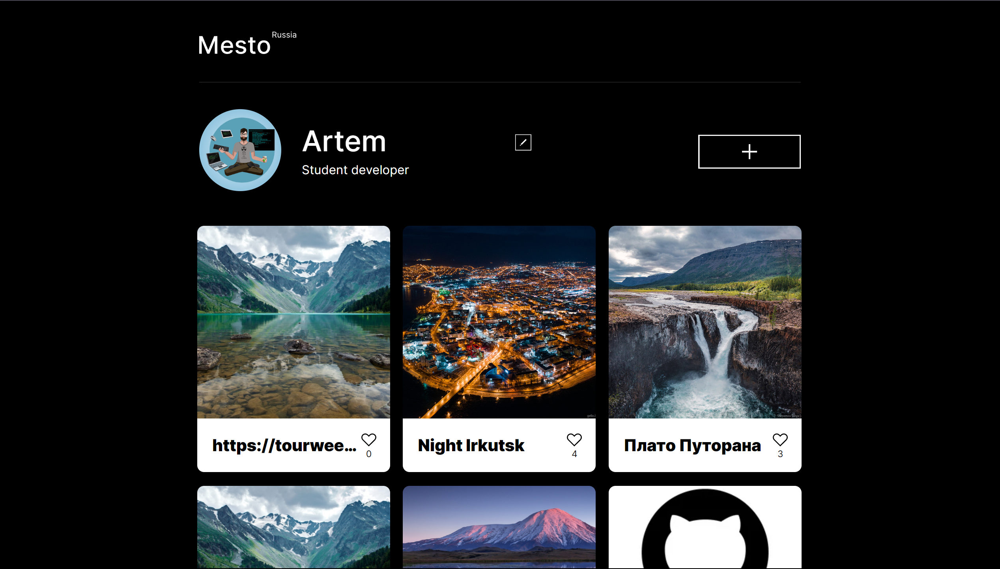

# Проекта "Место на React"🌍

###

  

### 📜Описание:
Mesto-React - это учебный проект, выполненный на React, который представляет собой веб-приложение для просмотра и добавления фотографий мест со всего мира. Выполнен в рамках серии проектных работ в Яндекс.Практикуме по профессии «Веб-разработчик» (от начала изучения React, спринт 10).

### 🪄 Функционал
- Редактировать имя профиля и статус;
- Добавлять свои кастомные карточки;
- Удалять свои карточки по кнопке;
- Поставить лайк любой карточке;
- Открыть картинку карточки отдельно почти во весь экран;
- Все карточки, профиль, аватар загружается с сервера, при изменении загружается на сервер;
- Реализовано плавное открытие и закрытие;
- Настроена валидация полей и блокирование кнопки при ошибках;
- Функционал разбит на файлы.

### 🛠️ Технологии:
- JavaScript
- React
- Create React App

### 🔢 Методология
Проект выполнен в соответствии с методологией BEM (Nested), что обеспечивает лучшую читаемость и поддерживаемость кода.

[Ссылка на проект Mesto-React (версия на React) на GitHub Pages](https://asaevartemv.github.io/mesto-react/)

